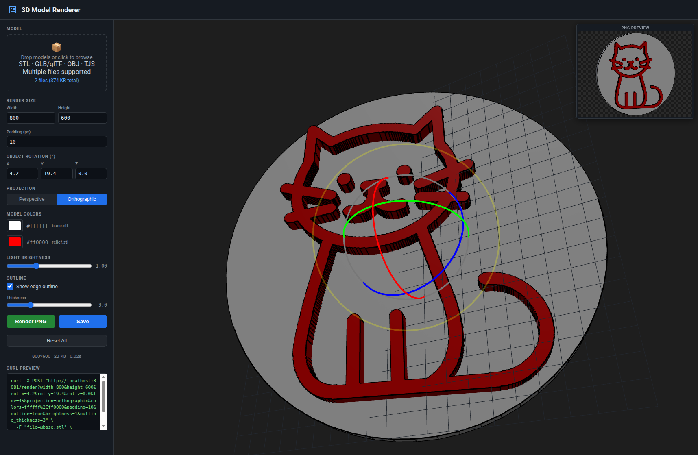

# 3D Model Renderer

Dockerised microservice that renders 3D model files to PNG images using a Rust software rasterizer. Includes a Three.js live-preview frontend.

**Supported formats:** STL (binary & ASCII), GLB/glTF, OBJ, TJS (CadQuery Three.js JSON)

Live demo at [https://stlrenderer.dennis960.com](https://stlrenderer.dennis960.com).

**There is no rate limiting. If someone abuses the public API, I will shut down the demo server, so please be considerate.**



## Quick Start

### Build from source:

```bash
docker compose up --build
# Open http://localhost:8080
```

Or with plain Docker:

```bash
docker build -t stl-renderer .
docker run -p 8080:8080 stl-renderer
```

### Pre-built image:

Use the pre-built docker image:

```bash
docker run -p 8080:8080 ghcr.io/dennis960/stlrenderer:latest
```

Or the example [docker-compose.yml](docker-compose.yml):

## API

### `GET /health`

Returns `{"status":"ok"}`.

### `POST /render`

Upload one or more 3D models (STL, GLB, glTF, OBJ, or TJS) as multipart form data fields all named `file`, receive a PNG.

**Query parameters:**

| Param               | Type   | Default       | Description                                                                                                      |
| ------------------- | ------ | ------------- | ---------------------------------------------------------------------------------------------------------------- |
| `width`             | int    | 800           | Image width (1–4096)                                                                                             |
| `height`            | int    | 600           | Image height (1–4096)                                                                                            |
| `rot_x`             | float  | 0             | Rotate the whole scene around X axis (degrees)                                                                   |
| `rot_y`             | float  | 0             | Rotate the whole scene around Y axis (degrees)                                                                   |
| `rot_z`             | float  | 0             | Rotate the whole scene around Z axis (degrees)                                                                   |
| `fov`               | float  | 45            | Camera field of view (degrees, only for perspective camera)                                                      |
| `projection`        | string | "perspective" | Projection type: "perspective" or "orthographic"                                                                 |
| `color`             | string | `#cccccc`     | Base color in hex (e.g. `ff0000` or `#ff0000`). May be repeated (`?color=ff0000&color=00ff00`) to assign per-model colors. If fewer colors than models are provided, the last color is reused; if omitted, a default is used. |
| `padding`           | int    | 10            | Additional padding around the model (pixels)                                                                     |
| `outline`           | bool   | false         | Draw black edge outlines on the model geometry                                                                   |
| `outline_thickness` | float  | 1.0           | Outline line thickness in pixels (0.5–10)                                                                        |
| `brightness`        | float  | 1.0           | Light brightness multiplier (0–3)                                                                                |

**Example with curl:**

```bash
# Single STL
curl -X POST "http://localhost:8080/render?width=1024&height=768&rot_x=30&rot_y=45&fov=60" \
  -F "file=@model.stl" -o render.png

# GLB
curl -X POST "http://localhost:8080/render?width=800&height=600" \
  -F "file=@model.glb" -o render.png

# OBJ with a custom color
curl -X POST "http://localhost:8080/render?width=800&height=600&color=cc8844" \
  -F "file=@model.obj" -o render.png

# Multiple models, each with its own color
curl -X POST "http://localhost:8080/render?width=1200&height=500&rot_x=20&rot_y=40&color=cccccc&color=c8a888&color=8ac890" \
  -F "file=@examples/cube.stl" \
  -F "file=@examples/sphere.stl" \
  -F "file=@examples/cylinder.stl" \
  -o render.png

# With outline
curl -X POST "http://localhost:8080/render?width=800&height=600&outline=true" \
  -F "file=@model.stl" -o render.png
```
